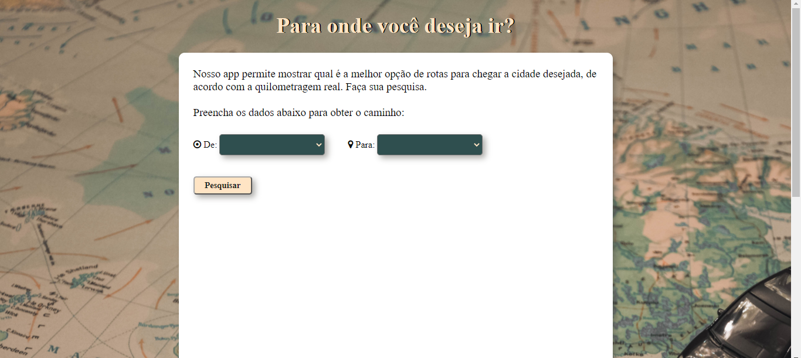
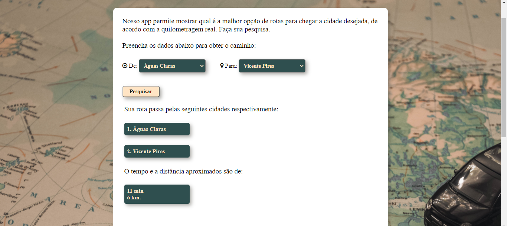
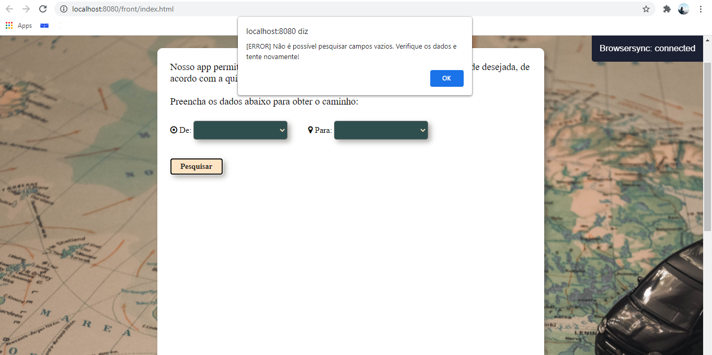
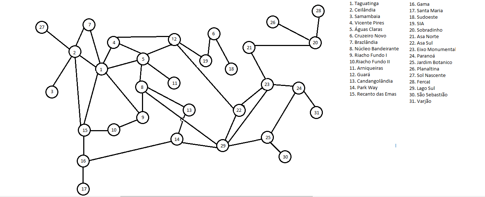

# Rotas DF

**Número da Lista**: 02   
**Conteúdo da Disciplina**: Grafos 2<br>

## Alunos
|Matrícula | Aluno |
| -- | -- |
| 16/0022673  |  Ailamar Alves Guimarães |
| 17/0080307  |  Matheus Amaral Moreira |

## Sobre 

Nesse projeto a dupla busca criar uma aplicação utilizando os métodos de melhor caminho adquiridos nas aulas, partindo de algo bem conhecido do dia-a-dia das pessoas que são os apps de serviço de pesquisa de mapas e rotas. Nossa aplicação consiste em retornar ao usuário o melhor caminho entre uma região administrativa e outra em relação à distância e tempo estimados* para se chegar ao destino final.

*A quilometragem e tempo utilizada nos pesos são aproximações estraídas de buscas no Google Maps.

## Screenshots

- Página inicial   
<br>



- Tela de Busca   
<br>


<br>

- Aviso de campos vazios   
<br>



- Esquema do grafo   
<br>




## Instalação 
**Linguagem**: JavaScript <br>
**Framework**: Node JS <br>

Nosso projeto consiste nas tecnologias NodeJS e um arquivo HTML como motores.

1. Abra o terminal em uma pasta e faça o clone do repositorio do GitHub para sua máquina:
```
$ git clone https://github.com/projeto-de-algoritmos/Grafos2-RotasDF.git
```

2. O segundo passo é entrar na pasta do repositório e instalar as dependências do NodeJS (para isso você deve ter o NodeJS já instalado):
```
$ cd ./Grafos2_RotasDF
$ npm install
```

3. Inicie o seu servidor NodeJs com o comando:
```
$ node .
```

4. Na pasta 'front' do repositório e abra o index.html.

5. Com a página iniciada faça suas buscas pelas cidades que deseja saber o caminho.

## Uso 
Selecione uma cidade no primeiro bloco, uma cidade no segundo bloco e clique em pesquisar. O resultado vai a rota com o menor custo da origem até o destino.

[Vídeo de explicação e uso do projeto.](https://youtu.be/gzQbET5a_XU)

## Outros 

Para encontrar o melhor caminho o algoritimo utilizado nesse projeto foi o Dijkstra.


